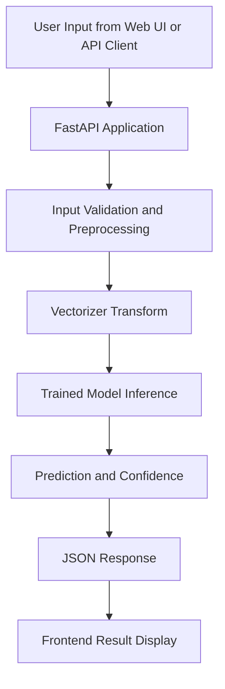

# Fake News Detector

📰 A minimal web app and API for detecting fake news headlines or articles using machine learning.

🔗 **[Live Demo](https://fake-news-detector.up.railway.app)**


Last updated: December 21, 2025

## 🧭 What It Does
- Detects whether a news headline or short article is likely fake or real.
- Accepts direct text input or file upload (PDF, Word, TXT).
- Shows probability/confidence and a simple explanation.
- Detects language automatically.
- Allows saving results as PDF or sharing.
- Animated, modern UI (PWA-ready for install on mobile/desktop).

## 🛠️ Skills & Technologies Used
- **Python** (FastAPI, scikit-learn, pandas, joblib)
- **Frontend**: HTML, CSS, JavaScript (animated UI, file upload, browser APIs)
- **File extraction**: PyPDF2, python-docx
- **API**: REST endpoints for prediction, extraction, health check
- **Testing**: pytest

## 🚀 How to Use

### 1. Install Requirements
```powershell
# Fake News Detector

## Description / Overview
Fake News Detector is a machine learning-powered web application that classifies news text as either fake or real. The project combines a FastAPI backend, a trained text classification pipeline, and a lightweight frontend interface to provide fast and accessible predictions for headlines and short articles.

It is designed as an end-to-end project covering model training, API development, and deployment-ready application structure.

## Features
- Binary classification of news text: fake or real.
- REST API endpoint for prediction.
- FastAPI backend with structured request/response handling.
- Trained model and vectorizer artifacts loaded for inference.
- Simple frontend interface served from static assets.
- Test coverage for API behavior using pytest.

## Tech Stack
- Python 3.11
- FastAPI
- Uvicorn
- scikit-learn
- pandas
- joblib
- pytest
- HTML, CSS, JavaScript

## Architecture / System Design
The application follows a straightforward request-response pipeline:



## Installation & Setup
### 1. Clone the repository
```bash
git clone https://github.com/suvadityaroy/Fake-News-Detector.git
cd Fake-News-Detector
```

### 2. Create and activate virtual environment (Windows PowerShell)
```powershell
python -m venv .venv
.\.venv\Scripts\Activate.ps1
```

### 3. Install dependencies
```powershell
pip install --upgrade pip
pip install -r requirements.txt
```

### 4. Train the model (if artifacts are not already present)
```powershell
python train.py
```

### 5. Run the application
```powershell
python -m uvicorn app.main:app --host 127.0.0.1 --port 8000
```

### 6. Open in browser
- Web UI: http://127.0.0.1:8000/static/
- API docs: http://127.0.0.1:8000/docs

## Author / Contact
Suvaditya Roy

GitHub: https://github.com/suvadityaroy