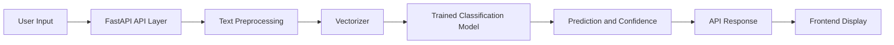

# Fake News Detector

## Description / Overview
Fake News Detector is a machine learning application that classifies news text as fake or real. It combines a trained NLP pipeline with a FastAPI backend and a lightweight web interface, providing a simple and reliable way to test headlines and short articles.

## Features
- Classifies input text as fake or real.
- Provides prediction confidence.
- Exposes REST API endpoints for inference.
- Serves a browser-based frontend from static assets.
- Includes test coverage for API behavior.

## Tech Stack
- Python 3.11
- FastAPI
- Uvicorn
- scikit-learn
- pandas
- joblib
- pytest
- HTML, CSS, JavaScript

## Architecture / System Design
The system follows a linear inference flow from user input to model prediction and response rendering.



## Installation & Setup
### 1. Clone repository
```bash
git clone https://github.com/suvadityaroy/Fake-News-Detector.git
cd Fake-News-Detector
```

### 2. Create and activate virtual environment (Windows PowerShell)
```powershell
python -m venv .venv
.\.venv\Scripts\Activate.ps1
```

### 3. Install dependencies
```powershell
pip install --upgrade pip
pip install -r requirements.txt
```

### 4. Train the model
```powershell
python train.py
```

### 5. Run application
```powershell
python -m uvicorn app.main:app --host 127.0.0.1 --port 8000
```

### 6. Access application
- Web UI: http://127.0.0.1:8000/static/
- API Docs: http://127.0.0.1:8000/docs

## Author / Contact
Suvaditya Roy

GitHub: https://github.com/suvadityaroy